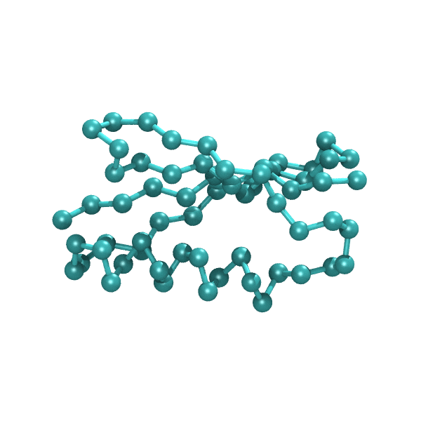
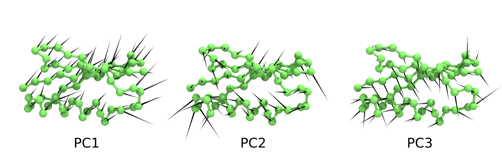

# ez-pca
Principal Component Analysis of Molecular Dynamics Trajectories.

A short demo of before and after applying the alignment:
- Before alignment (atomistic representation), protein is drifting in water

- After alignment (coarse-grained representation using CA backbone atoms)

The top 3 principal components are:

